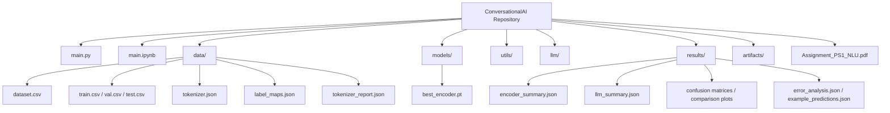
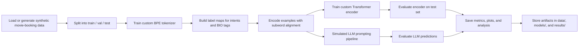
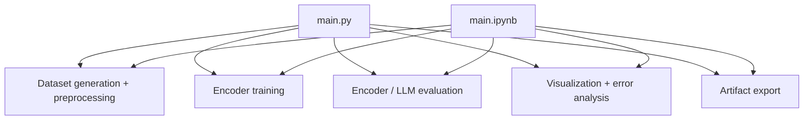

# Movie Booking Conversational AI — Repository Flow

This document explains the repository structure and how data moves through the project.

## Repository Map

## Project Flow

## Runtime Roles

## What Each Folder Does

- `data/`: raw/generated dataset, splits, tokenizer, and label metadata.
- `models/`: saved encoder checkpoint.
- `utils/`: preprocessing, tokenization, and metrics helpers.
- `models/`: custom Transformer encoder implementation.
- `llm/`: prompt-building and simulated LLM evaluation.
- `results/`: metrics, charts, error analysis, and comparison outputs.
- `artifacts/`: extra exported assets and scratch outputs.

## End-to-End Summary

1. Generate or load the movie-booking dataset.
2. Split data and train the tokenizer.
3. Convert intents and BIO tags into model-ready IDs.
4. Train the custom encoder on the labeled data.
5. Run the simulated LLM prompting baseline.
6. Compare both systems with metrics and plots.
7. Save outputs for inspection in `data/`, `models/`, and `results/`.
